# Lapres_Modul1_A09

### Kelompok A04:
- Iman Afandy (05111740000129)
- Nodas Uziel Putra Serpara (5111840007007)

## Display Filter
##  Nomor 1

Sebutkan webserver yang digunakan pada "testing.mekanis.me"!

jawab : 
Syntax : 1.	http.host contains "testing.mekanis.me"
 
 
 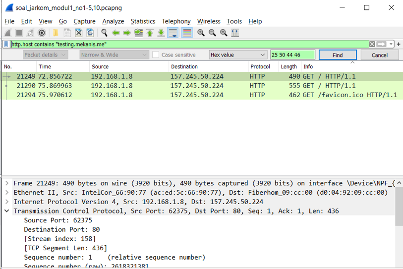
 
 webserver yang digunakan 
 
 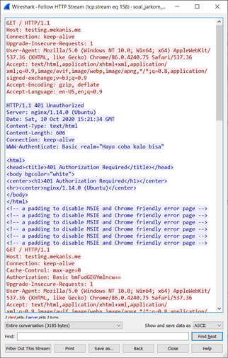
 
 
# Capture Filter

## Nomor 11 

Filter sehingga wireshark hanya mengambil paket yang mengandung port 21!
jawab :
 

Syntax :

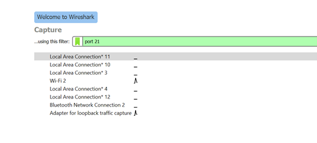
 

hasil capture :
Tidak ada packet yang tercapture 
 

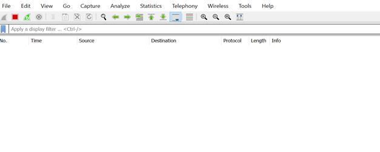

## Nomor 12 

 Filter sehingga wireshark hanya mengambil paket yang berasal dari port 80! 
 

 Syntax: 
 

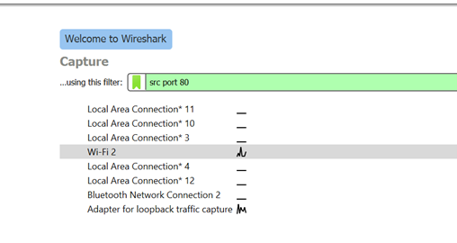

 hasil capture : 
 
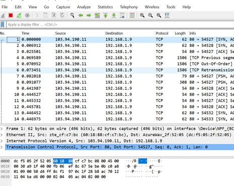

## Nomor 13 

 Filter sehingga wireshark hanya menampilkan paket yang menuju port 443! 

 Syntax: 
 

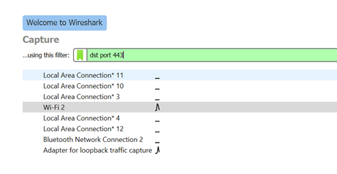

 hasil capture : 
 

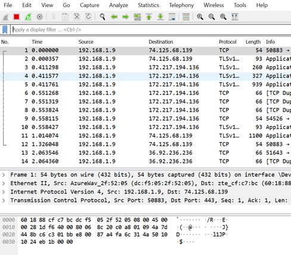

## Nomor 14 

 Filter sehingga wireshark hanya mengambil paket yang berasal dari ip kalian! 

 Syntax: 
 

 hasil capture : 

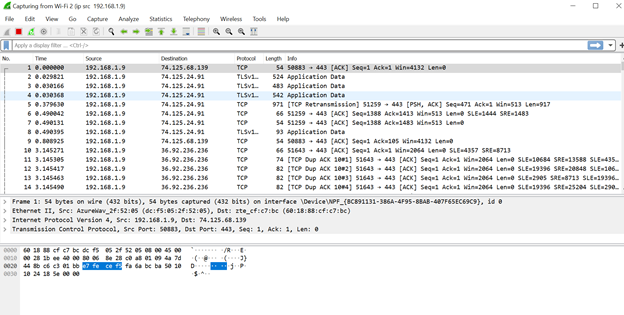

## Nomor 15

 Filter sehingga wireshark hanya mengambil paket yang tujuannya ke monta.if.its.ac.id! 

 Syntax: 

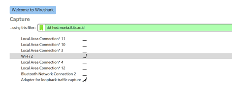

 hasil capture : 

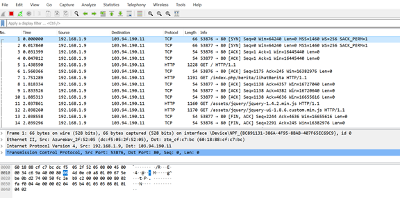

 
 
 
