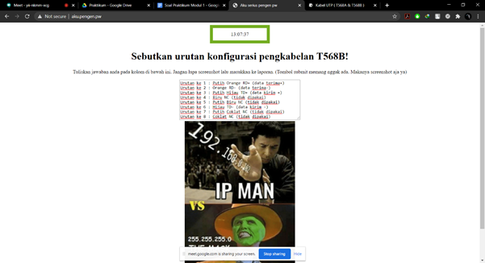
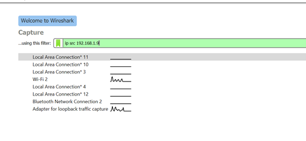

# Jarkom_Modul1_Lapres_A09

### Kelompok A09:
- Iman Afandy (05111740000129)
- Nodas Uziel Putra Serpara (5111840007007)

## Display Filter
##  Nomor 1

Sebutkan webserver yang digunakan pada "testing.mekanis.me"!

 jawab : 
 

Syntax : 1.	http.host contains "testing.mekanis.me" 

 
 
 
 
 
webserver yang digunakan 
 
 
 
 
 ##  Nomor 2 
 
 
 Simpan gambar "Tim_Kunjungan_Kerja_BAKN_DPR_RI_ke_Sukabumi141436.jpg"! 

 
 jawab : 

 
 Syntax: 
 
  
  
 
 export gambar yang dicari

 
  
 
 Hasil gambar yang sudah diunduh: 

   
  
  
## Nomor 3 

 Cari username dan password ketika login di "ppid.dpr.go.id"! 

 Jawab : 
 
 
 
 
## Nomor 4 

 Temukan paket dari web-web yang menggunakan basic authentication method! 

 Jawab: 

  
 
 
## Nomor 5 

 Ikuti perintah di aku.pengen.pw! Username dan password bisa didapatkan dari file .pcapng! 
 

 Isi aku.pengen.pw : 
 

 
 
 

 Syntax: 
 
 

  

 Setelah memasukan username dan password di aku.pengen.pw : 

 

 

## Nomor 6 

Seseorang menyimpan file zip melalui FTP dengan nama "Answer.zip". Simpan dan Buka file "Open This.pdf" di Answer.zip. Untuk mendapatkan password zipnya, temukan dalam file zipkey.txt (passwordnya adalah isi dari file txt tersebut).

Jawab:

 Display filter sehingga mendapat file zip yang diinginkan 

 

  

 Download file zip 

 Display filter sehingga mendapat file txt(password) 

 

 

 Berikut isi file txt(password) 

 

 Berikut isi file pdf dalam zip 
 
 

 

## Nomor 7 

 Ada 500 file zip yang disimpan ke FTP Server dengan nama 1.zip, 2.zip, ..., 500.zip. Salah satunya berisi pdf yang berisi puisi. Simpan dan Buka file pdf tersebut.
Your Super Mega Ultra Rare Hint = nama pdf-nya "Yes.pdf" 

 Jawab: 

Display filter sehingga mendapat file yang diinginkan 

  

 

 Lakukan Follow stream dan download file tersebut 

 Berikut isi file zip 

 

  

 Berikut isi file pdf 
 
 

 

## Nomor 8

 Cari objek apa saja yang didownload (RETR) dari koneksi FTP dengan Microsoft FTP Service! 

 Jawab: 
 

 Display filter : 
 
 

 

 Cek diantara keduanya yang menggunakan Microsoft FTP Service 

 

 

## Nomor 9

 Cari username dan password ketika login FTP pada localhost! 

 Jawab: 

 

 Terapkan display filter untuk mencari username dan password: 

 

 

## Nomor 10

Cari file .pdf di wireshark lalu download dan buka file tersebut!
clue: "25 50 44 46" 

 Jawab: 

 

 Display filter mencari file pdf 
 
 

 

 Find packet dengan hex value 25 50 44 46 

  

 

 Download file. Berikut isi file tersebut: 

 

 

 
 
 
 
# Capture Filter

## Nomor 11 

Filter sehingga wireshark hanya mengambil paket yang mengandung port 21!
jawab :
 

Syntax :

 

hasil capture :
Tidak ada packet yang tercapture 
 

## Nomor 12 

 Filter sehingga wireshark hanya mengambil paket yang berasal dari port 80! 
 

 Syntax: 
 

 hasil capture : 
 

## Nomor 13 

 Filter sehingga wireshark hanya menampilkan paket yang menuju port 443! 

 Syntax: 
 

 hasil capture : 
 

## Nomor 14 

 Filter sehingga wireshark hanya mengambil paket yang berasal dari ip kalian! 

ip address : 

 Syntax: 
 

 hasil capture : 

## Nomor 15

 Filter sehingga wireshark hanya mengambil paket yang tujuannya ke monta.if.its.ac.id! 

 Syntax: 

 hasil capture : 

 
 
 
